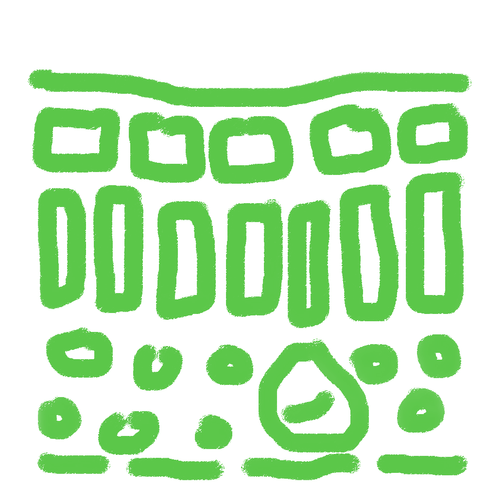

<div align="center">



# 🏨 Palisade Hotel Reservation System

[](https://www.oracle.com/java/technologies/downloads/#java17)
[](https://openjfx.io/)
[](https://maven.apache.org/)
[](https://firebase.google.com/)
[](#-rfid-hardware-login)
[](https://eng.asu.edu.eg/)

**A full-featured desktop hotel management system** built with Java 17 + JavaFX, featuring a rich dual-interface design, RFID card-based login, Firebase cloud integration, and persistent data storage — structured around a clean OOP architecture with three distinct user roles.

</div>

---

## 🎬 Project Demo

<div align="center">

[](https://youtu.be/0Bug0bVTbM8)

</div>

---

## 📦 Project Resources

<div align="center">

[](https://drive.google.com/drive/folders/1BJJXqeGWHp0oTbOwlTomSWOUWCYMq0A0?usp=drive_link)

</div>

> 👆 **Click the button above** to access the shared Drive folder. It contains everything you need to run and understand the project:

| File / Folder | Description |
|---|---|
| 🔑 `serviceAccountKey.json` | **Required** — Download this and place it in the project root to enable Firebase |
| 📄 Project Documentation | Full written report and system documentation |
| 🖼️ Class Diagram | High-resolution UML class diagram |
| 📎 Extra Attachments | Any additional design assets and references |

---

## 📋 Table of Contents

- [Overview](#-overview)
- [Features](#-features)
- [RFID Hardware Login](#-rfid-hardware-login)
- [System Architecture](#%EF%B8%8F-system-architecture)
- [Class Diagram](#-class-diagram)
- [Class Structure](#%EF%B8%8F-class-structure)
- [Role Capabilities](#-role-capabilities)
- [Project Structure](#-project-structure)
- [Prerequisites](#-prerequisites)
- [Getting Started](#-getting-started)
- [Default Demo Accounts](#-default-demo-accounts)
- [Tech Stack](#%EF%B8%8F-tech-stack)
- [Design Patterns & OOP Concepts](#-design-patterns--oop-concepts)
- [Academic Context](#-academic-context)
- [Team](#-team)

---

## 🔍 Overview

The **Palisade Hotel Reservation System** is a fully-featured desktop application that simulates real-world hotel management workflows. It supports three distinct user roles — **Guest**, **Receptionist**, and **Admin** — each with a dedicated interface and set of capabilities.

| Highlight | Description |
|---|---|
| 🪪 **RFID Login** | Physical card authentication via serial port — tap a card to log in |
| ☁️ **Firebase Integration** | Cloud-backed data with Firebase Admin SDK 9.2.0 |
| 💾 **Data Persistence** | Java Serialization saves/loads all system state to a `.diggers` file |
| 🖥️ **Dual Interface** | Full JavaFX GUI *and* a complete terminal-based console UI |
| 🔐 **Role-Based Access** | Strict permission separation across Guest, Receptionist, and Admin |
| 🏗️ **Pure OOP Design** | Inheritance hierarchy, interfaces, enums, and encapsulation throughout |

---

## ✨ Features

### 👤 Guest
- Browse all available rooms with type, amenities, and pricing
- Make room reservations with check-in / check-out date selection
- View all personal reservations with real-time status tracking
- Cancel pending reservations before confirmation
- Pay invoices and complete checkout with wallet balance deduction

### 🛎️ Receptionist
- Check guests in directly — creates a `CONFIRMED` reservation instantly
- Check guests out and collect payment (Cash, Credit Card, or Online)
- View and accept all pending reservation requests from guests
- Session-based working-hours tracking per receptionist

### 🔧 Admin
- **Room Management** — Full CRUD: create, view, update, and delete rooms with amenity configuration
- **Amenity Management** — Add, update, and delete amenities; changes auto-propagate to all rooms
- **Room Type Management** — Define and manage room categories (Single, Double, Suite, etc.) with referential integrity checks
- **RFID Management** — Assign and update RFID card IDs per user from the admin panel

### 🔐 System-Wide
- Standard username/password login + **RFID card login**
- Guest self-registration with wallet balance setup
- Protected staff registration (Admin code required)
- Real-time room occupancy tracking based on active reservations
- Full data persistence — save and reload all state across sessions

---

## 🪪 RFID Hardware Login

One of the standout features of this system is **physical RFID card-based authentication**.

```
┌─────────────┐    Serial (COM5)    ┌─────────────────────┐
│  RFID Card  │ ─────────────────▶  │  RFIDThread (Java)  │
│  (Tag/Card) │    9600 baud        │  reads card ID      │
└─────────────┘                     └──────────┬──────────┘
                                               │
                                    Match against DataBase.people
                                               │
                              ┌────────────────▼────────────────┐
                              │  Route to correct dashboard:    │
                              │  Admin   → theGoat.fxml         │
                              │  Guest   → guestscenebuilder    │
                              │  Staff   → Receptionists.fxml   │
                              └─────────────────────────────────┘
```

`RFIDThread` runs on a background thread, listens on `COM5` at 9600 baud, and matches the incoming tag ID against stored user records — then automatically navigates to the correct role dashboard.

> **Hardware:** Any Arduino-compatible RFID reader (e.g., RC522 + CH340) connected via USB serial. For Linux/macOS, update the port in `RFIDThread.java` to `/dev/ttyUSB0`.

---

## 🏗️ System Architecture

```
┌──────────────────────────────────────────────────────────────┐
│                       Entry Point (Main)                     │
│              Login / Register / RFID Auth / Role Dispatch    │
└────────────────────────────┬─────────────────────────────────┘
                             │
              ┌──────────────┼──────────────┐
              ▼              ▼              ▼
         ┌─────────┐   ┌──────────┐   ┌─────────┐
         │  Guest  │   │Reception-│   │  Admin  │
         │  Menu   │   │   ist    │   │  Menu   │
         └────┬────┘   └────┬─────┘   └────┬────┘
              │             │              │
              └─────────────┴──────────────┘
                            │
              ┌─────────────▼──────────────┐
              │          DataBase           │
              │    (In-Memory + Persisted)  │
              │  ├── rooms[]               │
              │  ├── reservations[]        │
              │  ├── invoices[]            │
              │  ├── people[]              │
              │  ├── guests[]              │
              │  ├── roomTypes[]           │
              │  └── amenities[]           │
              └─────────────┬──────────────┘
                            │
              ┌─────────────┴──────────────┐
              │      Persistence Layer      │
              │  Java Serialization →       │
              │  dataBase.diggers           │
              └────────────────────────────┘
```

---

## 📐 Class Diagram

<div align="center">


> 🔗 Full-resolution version available in the [📂 Drive folder](https://drive.google.com/drive/folders/1BJJXqeGWHp0oTbOwlTomSWOUWCYMq0A0?usp=drive_link).

</div>

**Key relationships at a glance:**

- `User` is the root of the inheritance tree — `Guest` and the abstract `Staff` (which branches into `Admin` and `Receptionist`) all extend it.
- `DataBase` is the central static store holding `ArrayList` collections for rooms, reservations, invoices, people, room types, and amenities.
- `Reservation` links a `Guest` to a `Room`, carries a `ReservationStatus` enum (`PENDING → CONFIRMED → COMPLETED / CANCELLED`), and generates exactly one `Invoice`.
- `Room` is categorized by a `RoomType` and includes zero or more `Amenity` items; both implement the `roomstuff` interface.
- `Invoice` holds a `PaymentMethod` enum (`CASH`, `CREDIT_CARD`, `ONLINE`) and references back to its `Reservation`.

---

## 🗂️ Class Structure

```
User  (base class)
├── Guest            — extends User, implements users
└── Staff            — abstract, extends User
    ├── Admin        — extends Staff
    └── Receptionist — extends Staff

Room                 — implements roomstuff
RoomType             — implements roomstuff
Amenity              — implements roomstuff
Reservation          — implements reservationProcess
Invoice              — implements reservationProcess
DataBase             — central static store + serialization
Validation           — input sanitization utilities
RFIDThread           — background RFID card auth thread (Runnable)
Main                 — application entry point & role dispatch

── GUI Layer ─────────────────────────────────────────────────
Controllers/
  ├── theGOATcontroller        — Login / Register / RFID controller
  ├── GuestController          — Guest GUI actions
  └── Receptionist_Controller  — Receptionist GUI

Screens/
  ├── LoginPage                — JavaFX login screen
  ├── AdminDashboard           — Admin GUI launcher
  └── ScreenUtility            — Shared screen helpers
```

---

## 👥 Role Capabilities

| Capability | 👤 Guest | 🛎️ Receptionist | 🔧 Admin |
|---|:---:|:---:|:---:|
| View Available Rooms | ✅ | ✅ | ✅ |
| Make Reservation | ✅ | — | — |
| Cancel Reservation | ✅ | — | — |
| View Own Reservations | ✅ | — | — |
| Pay Invoice / Checkout | ✅ | ✅ | — |
| Check Guest In | — | ✅ | — |
| Accept Pending Requests | — | ✅ | — |
| Manage Rooms (CRUD) | — | — | ✅ |
| Manage Amenities (CRUD) | — | — | ✅ |
| Manage Room Types (CRUD) | — | — | ✅ |
| Manage RFID Cards | — | — | ✅ |
| RFID Card Login | ✅ | ✅ | ✅ |

---

## 📁 Project Structure

```
Disktop-Hotel-Reservation-System-CSE241/
│
├── pom.xml                              # Maven build configuration
├── dataBase.diggers                     # Serialized persistent data file
│
└── src/main/
    ├── java/
    │   ├── Screens/
    │   │   ├── AdminDashboard.java
    │   │   ├── LoginPage.java
    │   │   └── ScreenUtility.java
    │   │
    │   └── com/mycompany/desktophotelreservationsystem/
    │       ├── Main.java                     # App entry point & role dispatch
    │       ├── DataBase.java                 # Central store + serialization
    │       ├── User.java                     # Base user class
    │       ├── Guest.java                    # Guest role & actions
    │       ├── Staff.java                    # Abstract staff base class
    │       ├── Admin.java                    # Admin CRUD operations
    │       ├── Receptionist.java             # Receptionist workflow
    │       ├── Room.java                     # Room entity
    │       ├── RoomType.java                 # Room category entity
    │       ├── Amenity.java                  # Amenity entity
    │       ├── Reservation.java              # Reservation lifecycle
    │       ├── Invoice.java                  # Payment invoice
    │       ├── Message.java                  # Messaging entity
    │       ├── RFIDThread.java               # 🪪 RFID background auth thread
    │       ├── Validation.java               # Input sanitization utilities
    │       ├── InvalidBalanceException.java  # Custom exception
    │       ├── users.java                    # User interface
    │       ├── roomstuff.java                # Room-related interface
    │       ├── reservationProcess.java       # Reservation interface
    │       │
    │       └── Controllers/
    │           ├── theGOATcontroller.java        # Login / Register / RFID GUI
    │           ├── GuestController.java           # Guest GUI controller
    │           └── Receptionist_Controller.java   # Receptionist GUI
    │
    └── resources/
        ├── Style.css / receptionist.css / hadi.css
        ├── Login.fxml · Register.fxml · theGoat.fxml
        ├── Receptionists.fxml · ReceptionistCheckIn/Out.fxml
        ├── guestscenebuilder.fxml · guestMakeReservations.fxml
        ├── guestViewReservation/CancelReservation/PayInvoice.fxml
        ├── adminRooms / adminAmenities / adminRoomTypes / adminRFID .fxml
        └── Images/                          # UI assets & class diagram
```

---

## ✅ Prerequisites

| Tool | Version | Link |
|---|---|---|
| Java JDK | 17+ | [Download](https://www.oracle.com/java/technologies/downloads/#java17) |
| Apache Maven | 3.6+ | [Download](https://maven.apache.org/download.cgi) |
| JavaFX | 17.0.2 | Managed automatically via Maven |
| Firebase Config | — | Download `serviceAccountKey.json` from the [Drive folder ↓](https://drive.google.com/drive/folders/1BJJXqeGWHp0oTbOwlTomSWOUWCYMq0A0?usp=drive_link) |

```bash
java -version     # Expected: openjdk 17.x.x
mvn -version      # Expected: Apache Maven 3.x.x
```

---

## 🚀 Getting Started

### 1. Clone the Repository

```bash
git clone https://github.com/your-username/Disktop-Hotel-Reservation-System-CSE241.git
cd Disktop-Hotel-Reservation-System-CSE241
```

### 2. Add Firebase Config

Download `serviceAccountKey.json` from the **[📂 Project Drive folder](https://drive.google.com/drive/folders/1BJJXqeGWHp0oTbOwlTomSWOUWCYMq0A0?usp=drive_link)** and place it in the project root directory. This is required for Firebase to work.

### 3. Build

```bash
mvn clean install
```

### 4. Run the JavaFX GUI

```bash
mvn javafx:run
```

### 5. Run the Console Interface (IDE Alternative)

1. Open in **IntelliJ IDEA** or **Eclipse** as a Maven project
2. Run `Main.java` → full terminal UI
3. Run `LoginPage.java` → JavaFX GUI

> **Note:** On first run, demo data is loaded via `DataBase.demoFill()`. All data is saved to `dataBase.diggers` and reloaded automatically on subsequent runs.

---

## 🔑 Default Demo Accounts

| Role | Username | Password |
|---|---|---|
| 🔧 Admin | `Ahmed` | `67` |
| 👤 Guest | `Baraa` | `67` |
| 🛎️ Receptionist | `Youssef` | `67` |

### Demo Rooms

| Room # | Type | Price/Night | Amenities |
|---|---|---|---|
| 67 | Suite | $670 | Gym, Coffee Machine |
| 108 | Single | $100 | Gym |
| 123 | Double | $150 | Free WiFi, Pool |

### Demo Amenities

| Name | Add-On Price |
|---|---|
| 🏊 Pool | $50 |
| 🏋️ Gym | $30 |
| 📶 Free WiFi | $10 |
| ☕ Coffee Machine | $5 |

---

## 🛠️ Tech Stack

| Technology | Version | Purpose |
|---|---|---|
| Java | 17 | Core application language |
| JavaFX | 17.0.2 | Desktop GUI framework |
| FXML + CSS | — | Declarative UI layout & styling |
| Apache Maven | 3.x | Build automation & dependency management |
| Firebase Admin SDK | 9.2.0 | Cloud integration |
| ControlsFX | 11.1.2 | Enhanced JavaFX UI components |
| jSerialComm | 2.11.0 | RFID serial port communication |
| Java Serialization | — | Local data persistence (`.diggers` file) |

---

## 🧱 Design Patterns & OOP Concepts

**Inheritance**
```
User
├── Guest
└── Staff (abstract)
    ├── Admin
    └── Receptionist
```

**Polymorphism** — `Main` dispatches to role-specific menus via `instanceof`; `viewRooms()` is overridden per role.

**Encapsulation** — All fields are private with getter/setter contracts; `Validation` centralizes input sanitization.

**Interfaces**
```java
users              // All user-facing classes
roomstuff          // Room, RoomType, Amenity
reservationProcess // Reservation, Invoice
Runnable           // RFIDThread (background auth)
```

**Method Chaining**
```java
new Room(67, suite, 670).addAmenity(gym).addAmenity(coffee);
```

**Enum State Management**
```java
enum ReservationStatus { PENDING, CONFIRMED, CANCELLED, COMPLETED }
enum PaymentMethod     { CASH, CREDIT_CARD, ONLINE }
```

**Concurrency**
```java
new Thread(new RFIDThread()).start(); // Non-blocking RFID listener
```

**Data Persistence**
```java
DataBase.saveData("dataBase.diggers"); // Serialize all state
DataBase.loadData("dataBase.diggers"); // Restore on next launch
```

---

## 🎓 Academic Context

> **CSE241 — Object-Oriented Programming**  
> Faculty of Engineering, Ain Shams University

---

## 👨‍💻 Team

| Name | Student ID |
|---|---|
| Yousef Abdullah | 25P0436 |
| Ahmed Ramy | 25P0187 |
| Hadi Mohamed | 25P0162 |
| Baraa Khaled | 25P0104 |
| Youssef Mohamed | 25P0208 |

---

<div align="center">

Made with ☕ and late nights — **Ain Shams University · CSE241**

</div>
